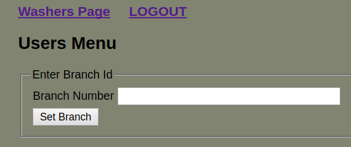
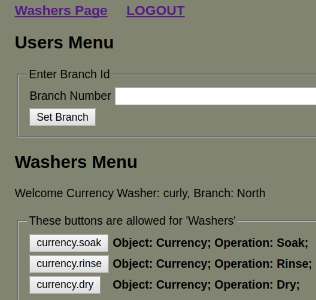
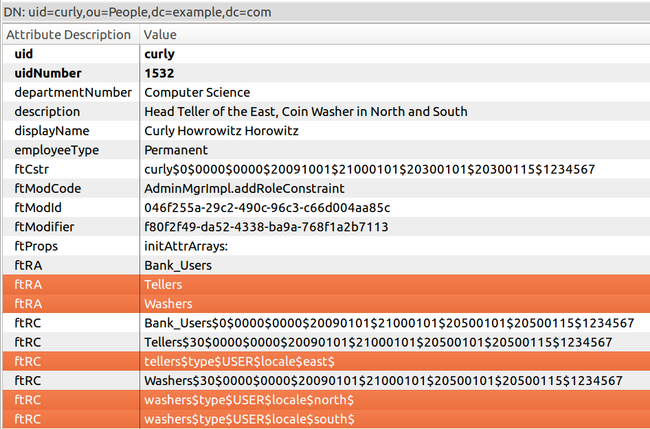

# Overview of the rbac-abac-sample README

 * This document demonstrates how to build and deploy the fortress rbac with abac sample.
 * The intent is to demonstrate using attributes to control role activation within an Apache Wicket Web app.
 * For more info about the idea: [Towards an Attribute-Based Role-Based Access Control System](https://iamfortress.net/2018/07/07/towards-an-attribute-based-role-based-access-control-system/)

-------------------------------------------------------------------------------
## Table of Contents
 * SECTION 1. Prerequisites
 * SECTION 2. Prepare Tomcat for Java EE Security
 * SECTION 3. Prepare rbac-abac-sample package
 * SECTION 4. Build and deploy rbac-abac-sample
 * SECTION 5. Understand the security policy
 * SECTION 6. Manually Test the RBAC with ABAC sample
 * SECTION 7. Automatically Test the RBAC with ABAC sample (using Selenium)
 * SECTION 8. Under the Covers (Learn how it works here)

-------------------------------------------------------------------------------
## SECTION I. Prerequisites
1. Java 8
2. Apache Maven 3++
3. Apache Tomcat 7++
4. Basic LDAP server setup by completing either Quickstart
    * [OpenLDAP & Fortress QUICKSTART on DOCKER](https://github.com/apache/directory-fortress-core/blob/master/README-QUICKSTART-DOCKER-SLAPD.md)
    * [APACHEDS & Fortress QUICKSTART on DOCKER](https://github.com/apache/directory-fortress-core/blob/master/README-QUICKSTART-DOCKER-APACHEDS.md)

-------------------------------------------------------------------------------
## SECTION II. Prepare Tomcat for Java EE Security

This sample web app uses Java EE security.

#### 1. Download the fortress realm proxy jar into tomcat/lib folder:

  ```bash
  wget http://repo.maven.apache.org/maven2/org/apache/directory/fortress/fortress-realm-proxy/2.0.2/fortress-realm-proxy-2.0.2.jar -P $TOMCAT_HOME/lib
  ```

 * Where `$TOMCAT_HOME` points to the execution env.

 Note: The realm proxy enables Tomcat container-managed security functions to call back to fortress.

#### 2. Optional - Prepare tomcat to allow autodeploy of rbac-abac-sample web app:

 ```bash
 sudo vi /usr/local/tomcat8/conf/tomcat-users.xml
 ```

#### 3. Optional - Add tomcat user to deploy rbac-abac-sample:

 ```xml
 <role rolename="manager-script"/>
 <user username="tcmanager" password="m@nager123" roles="manager-script"/>
 ```

#### 4. Restart tomcat for new settings to take effect.

-------------------------------------------------------------------------------
## SECTION III. Prepare rbac-abac-sample package

#### 1. Stage the project.

 a. Download and extract from Github:

 ```bash
 wget https://github.com/shawnmckinney/rbac-abac-sample/archive/master.zip
 ```

 -- Or --

 b. Or `git clone` locally:

 ```git
 git clone https://github.com/shawnmckinney/rbac-abac-sample.git
 ```

#### 2. Change directory into it:

 ```bash
 cd rbac-abac-sample
 ```

#### 3. Enable an LDAP server:

 a. Copy the example:

 ```bash
 cp src/main/resources/fortress.properties.example src/main/resources/fortress.properties
 ```

 b. Edit the file:

 ```bash
 vi src/main/resources/fortress.properties
 ```

 Pick either Apache Directory or OpenLDAP server:

 c. Prepare fortress for ApacheDS usage:

 ```properties
 # This param tells fortress what type of ldap server in use:
 ldap.server.type=apacheds

 # Use value from [Set Hostname Entry]:
 host=localhost

 # ApacheDS defaults to this:
 port=10389

 # These credentials are used for read/write access to all nodes under suffix:
 admin.user=uid=admin,ou=system
 admin.pw=secret
 ```

 -- Or --

 d. Prepare fortress for OpenLDAP usage:

 ```properties
 # This param tells fortress what type of ldap server in use:
 ldap.server.type=openldap

 # Use value from [Set Hostname Entry]:
 host=localhost

 # OpenLDAP defaults to this:
 port=389

 # These credentials are used for read/write access to all nodes under suffix:
 admin.user=cn=Manager,dc=example,dc=com
 admin.pw=secret
 ```

-------------------------------------------------------------------------------
## SECTION IV. Build and deploy rbac-abac-sample

#### 1. Verify the java and maven home env variables are set.

 ```maven
 mvn -version
 ```

 This sample requires Java 8 and Maven 3 to be setup within the execution env.

#### 2. Build the sample and load test data:

  ```maven
 mvn install -Dload.file
  ```

 Build Notes:
 * `-Dload.file` automatically loads the [rbac-abac-sample security policy](src/main/resources/rbac-abac-sample-security-policy.xml) data into ldap.
 * This load needs to happen just once for the default test cases to work and may be dropped from future `mvn` commands.

#### 3. Deploy the sample to Tomcat:

 a. If using autodeploy feature, verify the Tomcat auto-deploy options are set correctly in the [pom.xml](pom.xml) file:
 ```xml
 <plugin>
     <groupId>org.codehaus.mojo</groupId>
     <artifactId>tomcat-maven-plugin</artifactId>
     <version>1.0-beta-1</version>
     <configuration>
     ...
         <url>http://localhost:8080/manager/text</url>
         <path>/${project.artifactId}</path>
         <username>tcmanager</username>
         <password>m@nager123</password>
     </configuration>
 </plugin>
 ```

 b. Now, automatically deploy to tomcat server:

  ```maven
 mvn clean tomcat:deploy
  ```

 c. To automatically redeploy sample app:

  ```maven
 mvn clean tomcat:redeploy
  ```

 d. To manually deploy app to Tomcat:

 ```bash
 cp target/rbac-abac-sample.war $TOMCAT_HOME/webapps
 ```

 * Where `$TOMCAT_HOME` points to the execution env.

-------------------------------------------------------------------------------
## SECTION V. Understand the security policy

To gain full understanding, check out the file used to load it into the LDAP directory: [rbac-abac-sample security policy](src/main/resources/rbac-abac-sample-security-policy.xml).

App comprised of three pages, each has buttons and links that are guarded by permissions.  The permissions are granted to a particular user via their role activations.

#### 1. User-to-Role Assignment Table

 For this app, user-to-role assignments are:

| user       | Tellers     | Washers  |
| ---------- | ----------- | -------- |
| curly      | true        | true     |
| moe        | true        | true     |
| larry      | true        | true     |

#### 2. User-to-Role Activation Table by Branch

 But we want to control role activation using attributes based on Branch location:

| user       | Tellers   | Washers       |
| ---------- | --------- | ------------- |
| curly      | East      | North, South  |
| moe        | North     | East, South   |
| larry      | South     | North, East   |

 *Even though the test users are assigned both roles, they are limited which can be activated by branch.*

#### 3. Role-to-Role Dynamic Separation of Duty Constraint Table

 Furthermore due to toxic combination, we must never let a user activate both roles simultaneously regardless of location. For that, we'll use a dynamic separation of duty policy.

| set name      | Set Members   | Cardinality   |
| ------------- | ------------- | ------------- |
| Bank Safe     | Washers       | 2             |
|               | Tellers       |               |
|               |               |               |

#### 4. Role-Permission Table Links

 The page links are guarded by RBAC permissions that dependent on which roles are active in the session.

| role       | WashersPage | TellersPage |
| ---------- | ----------- | ----------- |
| Tellers    | false       | true        |
| Washers    | true        | false       |

#### 5. Role-Permission Table Buttons

 The buttons on the page are also guarded by RBAC permissions.

| role       | Account.deposit | Account.withdrawal | Account.inquiry  | Currency.soak | Currency.rise | Currency.dry |
| ---------- | --------------- | ------------------ | ---------------- | ------------- | ------------- | ------------ |
| Tellers    | true            | true               | true             | false         | false         | false        |
| Washers    | false           | false              | false            | true          | true          | true         |

-------------------------------------------------------------------------------
## SECTION VI. Manually Test the RBAC with ABAC sample

#### 1. Open link to [http://localhost:8080/rbac-abac-sample](http://localhost:8080/rbac-abac-sample)

#### 2. Login with Java EE authentication form:

#### 3. User-Password Table

 | userId        | Password      |
 | ------------- | ------------- |
 | curly         | password      |
 | moe           | password      |
 | larry         | password      |

#### 4. Enter a location for user and click on the button.

 ```
 Enter North, South or East
 ```

 

#### 5. Once the location is set, a link will appear corresponding with the user's allowed role for that location.

 

#### 6. Click on the link, and then buttons appear simulating user access for that particular location.

 

#### 7. Change locations, and a different link appears, with different operations.

 This is RBAC with ABAC in action, limiting which role may be activated in the session by location.

#### 8. Try a different user.

 Each has different access rights to application.

## SECTION VII. Automatically Test the RBAC with ABAC sample

 Run the selenium automated test:

 ```maven
 mvn test -Dtest=RbacAbacSampleSeleniumITCase
 ```

 Selenium Test Notes:
 * *This test will log in as each user, perform positive and negative test cases.*
 * *Requires Firefox on target machine.*

-------------------------------------------------------------------------------
## SECTION VIII. Under the Covers

 How does this work?  Have a look at some code...

 Paraphrased from [WicketSampleBasePage.java](src/main/java/org/rbacabac/WicketSampleBasePage.java):

 ```java
 // Nothing new here:
  User user = new User(userId);

  // This is new:
  RoleConstraint constraint = new RoleConstraint( );

  // In practice we're not gonna pass hard-coded key-values in here, but you get the idea:
  constraint.setKey( "locale" );
  constraint.setValue( "north" );

  // This is just boilerplate goop:
  List<RoleConstraint> constraints = new ArrayList();
  constraints.add( constraint );

  try
  {
      // Now, create the RBAC session with an ABAC constraint, locale=north, asserted:
      Session session = accessMgr.createSession( user, constraints );
      ...
  }
 ```

 Pushing the **locale** attribute into the User's RBAC session the runtime will match that instance data with their stored policy.

 
 *Notice that this user has been assigned both Teller and Washer, via **ftRA** attribute, and that another attribute, **ftRC**, constrains where it can be activated.*

### How the ABAC algorithm works:
 * When the runtime iterates over assigned roles (ftRA), trying to activate them one-by-one, it matches the constraint pushed in, e.g. locale=north, with its associated role constraint (ftRC).
 * If it finds a match, the role can be activated into the session, otherwise not.

### When does it get executed:
 * During the [createSession](https://directory.apache.org/fortress/gen-docs/latest/apidocs/org/apache/directory/fortress/core/AccessMgr.html#createSession-org.apache.directory.fortress.core.model.User-boolean-) call, there's a role activation phase, where all of the constraints are applied.
 * Applying constraints is not a new concept with Fortress, check out, [What Are Temporal Constraints?](https://iamfortress.net/2015/06/11/what-are-temporal-constraints/), for more info.
 * Constraints are enabled via [fortress' configuration subsystem](https://github.com/apache/directory-fortress-core/blob/master/README-CONFIG.md).  Currently ABAC and temporal constraints are turned on by default.

### One more thing:
 * ABAC constraints work with any kind of instance data, e.g. account, organization, etc.  Let your imagination set the boundaries.